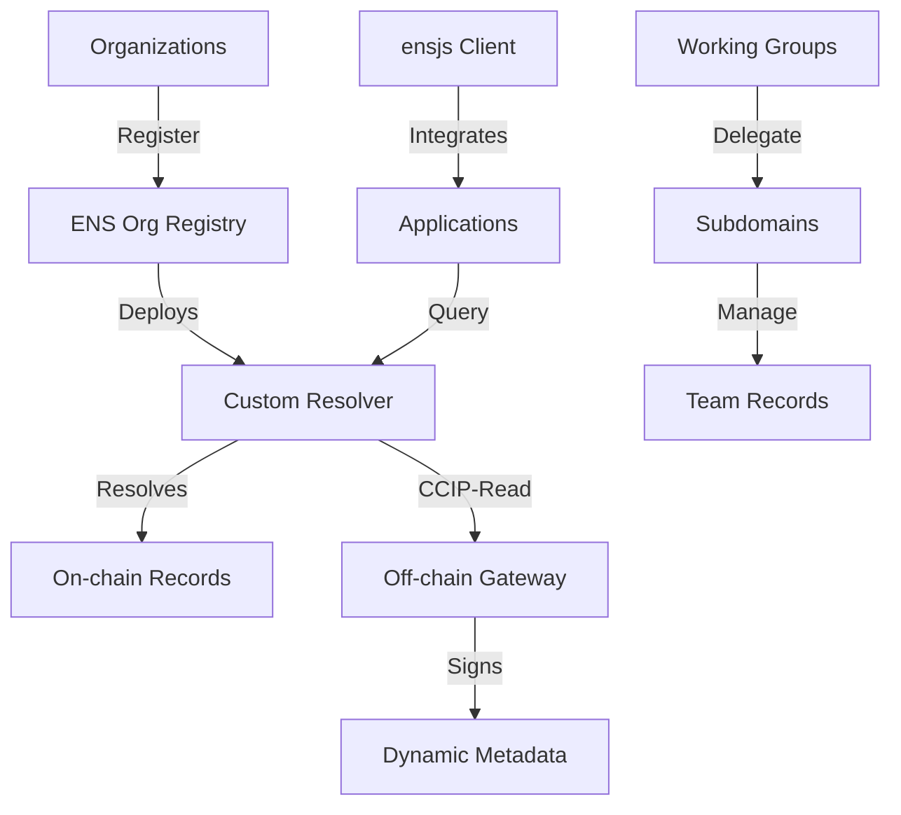

# Architecture Overview

The ENS Organizational Registry is built on a foundation of ENS standards, providing a comprehensive system for organizational identity management across multiple chains and platforms.

## Design Principles

1. **ENS Standards Compliance**: Full compatibility with existing ENS infrastructure and improvement proposals (ENSIPs)

2. **Governance-Driven Updates**: All organizational metadata changes controlled by DAO governance mechanisms

3. **Multi-chain Native**: Support for organizational addresses across L1, L2, and multiple blockchain networks

4. **Off-chain Scalability**: CCIP-Read integration for dynamic data and high-performance queries

5. **Subdomain Delegation**: Working groups and teams can manage their own subdomains autonomously

## High-Level Architecture

## Core Components

### ENS Org Registry
Central registry contract that:
- Manages organizational ENS domains and their resolvers
- Handles governance-controlled updates
- Maintains issuer/adapter relationships
- Enforces access control for organizational changes

### Custom Resolver
Enhanced ENS resolver supporting:
- **ENSIP-1**: Basic address resolution
- **ENSIP-5**: Text records for metadata
- **ENSIP-9/11**: Multi-chain address resolution
- **ENSIP-10**: Wildcard resolution for subdomains
- **ENSIP-12**: NFT/image avatar support
- **ENSIP-16**: Off-chain resolution via CCIP-Read

### CCIP-Read Gateway
Off-chain service providing:
- Dynamic metadata (voting status, member counts)
- Batch query optimization (ENSIP-21)
- Governance-signed responses
- Caching for performance
- Real-time organizational data

### Subdomain Management
Delegated subdomain system enabling:
- Working group autonomy (`engineering.myorg.eth`)
- Role-based access control
- Team-specific metadata and addresses
- Hierarchical governance structures

### Multi-chain Resolution
Cross-chain address resolution supporting:
- Ethereum mainnet (coin type 60)
- Layer 2 networks (Polygon 137, Arbitrum 42161, Optimism 10)
- Custom coin types for specialized networks
- Automatic chain detection and routing

## Data Flow

### Registration Flow
1. Organization owns ENS domain (`myorg.eth`)
2. Registers with ENS Org Registry
3. Custom resolver deployed and assigned
4. Initial metadata and addresses set
5. Governance permissions configured

### Resolution Flow
1. Client queries `myorg.eth` for data
2. Custom resolver checks on-chain records
3. If CCIP-Read enabled, queries off-chain gateway
4. Gateway returns signed response with fresh data
5. Resolver validates signature and returns result

### Governance Update Flow
1. DAO proposes metadata changes
2. Governance vote passes with required threshold  
3. Signed transaction updates resolver records
4. Off-chain gateway syncs new data
5. Next resolution returns updated information

## Security Model

The system's security relies on:

1. **ENS Infrastructure**: Leverages battle-tested ENS registry and resolver architecture
2. **Governance Controls**: All updates require DAO approval through established voting mechanisms
3. **Signature Verification**: Off-chain data cryptographically signed and verified on-chain
4. **Access Control**: Role-based permissions for different organizational functions
5. **Subdomain Isolation**: Delegated subdomains can't affect parent domain security

## Performance Considerations

- **On-chain Gas Optimization**: Batch operations and efficient storage patterns
- **Off-chain Caching**: Redis/memory caching for frequently accessed data
- **CCIP-Read Benefits**: Dynamic data without on-chain transaction costs
- **CDN Integration**: Global content delivery for avatar images and metadata
- **Batch Queries**: Single request for multiple organizational profiles

## Integration Points

The registry integrates with:
- **Existing ENS tooling**: ensjs, ENS App, other ENS-compatible applications
- **DAO frameworks**: Snapshot, Tally, Boardroom for governance integration
- **Multi-chain infrastructure**: Cross-chain bridges and L2 networks
- **IPFS/Arweave**: Decentralized storage for avatars and rich content
- **Web3 applications**: Dashboards, explorers, governance tools

