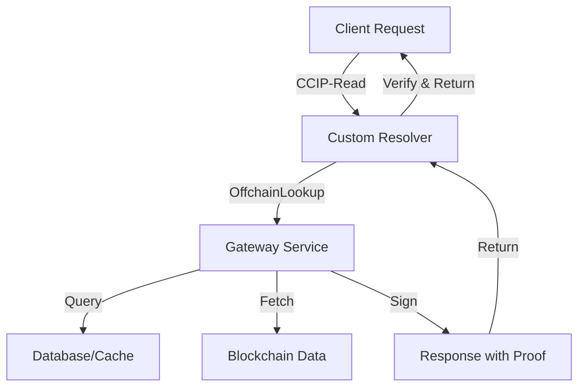

# CCIP-Read Gateway

The off-chain service that provides dynamic organizational metadata, batch query optimization, and governance-signed responses for high-performance ENS resolution.

## Overview

The CCIP-Read Gateway serves as the off-chain component of the ENS Organizational Registry, providing:
- **Dynamic Metadata**: Real-time governance status, member counts, voting information
- **Batch Operations**: Single request for multiple organizational profiles (ENSIP-21)
- **Performance Optimization**: Caching and CDN integration for fast response times
- **Cryptographic Security**: EIP-191 signed responses with on-chain verification

## Architecture



## Gateway Service Interface

### Core Endpoints
```typescript
interface CCIPGateway {
  // ENSIP-10 compliant resolution
  resolve(sender: string, data: string): Promise<{
    data: string;
    signature: string;
    expires: number;
  }>;
  
  // Organization metadata
  getOrgMetadata(name: string): Promise<OrgMetadata>;
  
  // Batch operations (ENSIP-21)
  batchResolve(requests: ResolveRequest[]): Promise<ResolveResponse[]>;
  
  // Real-time governance data
  getGovernanceStatus(name: string): Promise<GovernanceStatus>;
}
```

### Request/Response Types
```typescript
interface ResolveRequest {
  name: string;           // DNS-encoded name
  data: string;           // ABI-encoded call data
  sender: string;         // Resolver contract address
}

interface ResolveResponse {
  data: string;           // ABI-encoded response
  signature: string;      // EIP-191 signature
  expires: number;        // Unix timestamp
  extraData?: string;     // Additional context
}

interface OrgMetadata {
  name: string;
  alias: string;
  description: string;
  avatar: string;
  website: string;
  email: string;
  addresses: Record<number, string>;
  socialLinks: SocialLinks;
  governance: GovernanceStatus;
  subdomains: SubdomainInfo[];
  lastUpdate: number;
}
```

## Implementation

### Express.js Gateway Service
```typescript
import express from 'express';
import { ethers } from 'ethers';
import Redis from 'ioredis';

class CCIPGatewayService {
  private app: express.Application;
  private redis: Redis;
  private signer: ethers.Wallet;
  
  constructor(config: GatewayConfig) {
    this.app = express();
    this.redis = new Redis(config.redisUrl);
    this.signer = new ethers.Wallet(config.signingKey);
    this.setupRoutes();
  }
  
  private setupRoutes() {
    // ENSIP-10 resolution endpoint
    this.app.get('/resolve/:sender/:data', this.handleResolve.bind(this));
    
    // Organization metadata
    this.app.get('/org/:name/metadata', this.getOrgMetadata.bind(this));
    
    // Batch operations
    this.app.post('/batch', this.handleBatch.bind(this));
    
    // Governance status
    this.app.get('/org/:name/governance', this.getGovernanceStatus.bind(this));
  }
}
```

### Resolution Handler
```typescript
async handleResolve(req: Request, res: Response) {
  const { sender, data } = req.params;
  
  try {
    // Decode the call data to understand what's being requested
    const decodedCall = this.decodeCallData(data);
    
    // Fetch the requested data
    const result = await this.fetchData(decodedCall);
    
    // Create response with signature
    const response = await this.createSignedResponse(
      sender,
      data,
      result,
      300 // 5 minute TTL
    );
    
    res.json(response);
  } catch (error) {
    res.status(500).json({ error: error.message });
  }
}

private async createSignedResponse(
  sender: string,
  callData: string,
  result: any,
  ttl: number
): Promise<ResolveResponse> {
  const expires = Math.floor(Date.now() / 1000) + ttl;
  const encodedResult = ethers.utils.defaultAbiCoder.encode(['string'], [result]);
  
  // Create EIP-191 signature
  const messageHash = ethers.utils.solidityKeccak256(
    ['address', 'string', 'bytes', 'uint256'],
    [sender, callData, encodedResult, expires]
  );
  
  const signature = await this.signer.signMessage(
    ethers.utils.arrayify(messageHash)
  );
  
  return {
    data: encodedResult,
    signature,
    expires
  };
}
```

### Batch Operations (ENSIP-21)
```typescript
async handleBatch(req: Request, res: Response) {
  const requests: ResolveRequest[] = req.body.requests;
  
  try {
    // Process requests in parallel
    const responses = await Promise.all(
      requests.map(request => this.processRequest(request))
    );
    
    res.json({ responses });
  } catch (error) {
    res.status(500).json({ error: error.message });
  }
}

private async processRequest(request: ResolveRequest): Promise<ResolveResponse> {
  // Check cache first
  const cacheKey = `resolve:${request.name}:${request.data}`;
  const cached = await this.redis.get(cacheKey);
  
  if (cached) {
    return JSON.parse(cached);
  }
  
  // Fetch fresh data
  const decodedCall = this.decodeCallData(request.data);
  const result = await this.fetchData(decodedCall);
  
  const response = await this.createSignedResponse(
    request.sender,
    request.data,
    result,
    300
  );
  
  // Cache for future requests
  await this.redis.setex(cacheKey, 300, JSON.stringify(response));
  
  return response;
}
```

## Data Sources

### Blockchain Integration
```typescript
class BlockchainDataSource {
  private providers: Record<number, ethers.providers.Provider>;
  
  constructor(config: ChainConfig[]) {
    this.providers = {};
    config.forEach(chain => {
      this.providers[chain.chainId] = new ethers.providers.JsonRpcProvider(chain.rpcUrl);
    });
  }
  
  async getGovernanceStatus(governance: string, chainId: number): Promise<GovernanceStatus> {
    const provider = this.providers[chainId];
    const contract = new ethers.Contract(governance, GOVERNANCE_ABI, provider);
    
    const [
      proposalCount,
      activeProposals,
      tokenSupply,
      votingPower
    ] = await Promise.all([
      contract.proposalCount(),
      contract.getActiveProposals(),
      contract.totalSupply(),
      contract.getCurrentVotes(governance)
    ]);
    
    return {
      proposalCount: proposalCount.toNumber(),
      activeProposals: activeProposals.length,
      totalTokens: tokenSupply.toString(),
      votingPower: votingPower.toString(),
      lastUpdate: Math.floor(Date.now() / 1000)
    };
  }
}
```

### IPFS Integration
```typescript
class IPFSDataSource {
  private ipfs: IPFS;
  
  constructor(config: IPFSConfig) {
    this.ipfs = create(config);
  }
  
  async getAvatarMetadata(avatarUri: string): Promise<AvatarMetadata> {
    if (!avatarUri.startsWith('ipfs://')) {
      return { url: avatarUri, type: 'url' };
    }
    
    const hash = avatarUri.replace('ipfs://', '');
    const content = await this.ipfs.cat(hash);
    const metadata = JSON.parse(content.toString());
    
    return {
      url: `https://ipfs.io/ipfs/${hash}`,
      name: metadata.name,
      description: metadata.description,
      type: 'ipfs'
    };
  }
}
```

## Caching Strategy

### Redis Configuration
```typescript
interface CacheConfig {
  // Short-term cache for frequently accessed data
  shortTerm: {
    ttl: 300;           // 5 minutes
    pattern: 'org:*:metadata';
  };
  
  // Medium-term cache for semi-static data
  mediumTerm: {
    ttl: 3600;          // 1 hour
    pattern: 'org:*:addresses';
  };
  
  // Long-term cache for static data
  longTerm: {
    ttl: 86400;         // 24 hours
    pattern: 'org:*:profile';
  };
}

class CacheManager {
  constructor(private redis: Redis) {}
  
  async get<T>(key: string): Promise<T | null> {
    const cached = await this.redis.get(key);
    return cached ? JSON.parse(cached) : null;
  }
  
  async set<T>(key: string, value: T, ttl: number): Promise<void> {
    await this.redis.setex(key, ttl, JSON.stringify(value));
  }
  
  async invalidate(pattern: string): Promise<void> {
    const keys = await this.redis.keys(pattern);
    if (keys.length > 0) {
      await this.redis.del(...keys);
    }
  }
}
```

## Security Measures

### Rate Limiting
```typescript
import rateLimit from 'express-rate-limit';

const limiter = rateLimit({
  windowMs: 60 * 1000, // 1 minute
  max: 100, // limit each IP to 100 requests per windowMs
  message: 'Too many requests from this IP',
  standardHeaders: true,
  legacyHeaders: false,
});

app.use('/resolve', limiter);
```

### Input Validation
```typescript
import Joi from 'joi';

const resolveSchema = Joi.object({
  sender: Joi.string().pattern(/^0x[a-fA-F0-9]{40}$/).required(),
  data: Joi.string().pattern(/^0x[a-fA-F0-9]*$/).required()
});

async handleResolve(req: Request, res: Response) {
  const { error } = resolveSchema.validate(req.params);
  if (error) {
    return res.status(400).json({ error: error.message });
  }
  
  // Continue processing...
}
```

### CORS Configuration
```typescript
import cors from 'cors';

const corsOptions = {
  origin: [
    'https://app.ens.domains',
    'https://*.ens-org-registry.eth',
    /\.eth$/  // Allow .eth domains
  ],
  methods: ['GET', 'POST'],
  allowedHeaders: ['Content-Type', 'Authorization'],
  credentials: true
};

app.use(cors(corsOptions));
```

## Monitoring & Observability

### Metrics Collection
```typescript
import promClient from 'prom-client';

const requestCounter = new promClient.Counter({
  name: 'gateway_requests_total',
  help: 'Total number of gateway requests',
  labelNames: ['method', 'endpoint', 'status']
});

const responseTime = new promClient.Histogram({
  name: 'gateway_response_time_seconds',
  help: 'Response time in seconds',
  labelNames: ['method', 'endpoint']
});

// Middleware to collect metrics
app.use((req, res, next) => {
  const start = Date.now();
  
  res.on('finish', () => {
    const duration = (Date.now() - start) / 1000;
    requestCounter.labels(req.method, req.path, res.statusCode.toString()).inc();
    responseTime.labels(req.method, req.path).observe(duration);
  });
  
  next();
});
```

### Health Checks
```typescript
app.get('/health', async (req, res) => {
  const health = {
    status: 'ok',
    timestamp: new Date().toISOString(),
    services: {
      redis: 'unknown',
      blockchain: 'unknown',
      ipfs: 'unknown'
    }
  };
  
  try {
    // Check Redis
    await this.redis.ping();
    health.services.redis = 'ok';
  } catch (error) {
    health.services.redis = 'error';
    health.status = 'degraded';
  }
  
  // Check blockchain providers
  // Check IPFS connection
  
  res.status(health.status === 'ok' ? 200 : 503).json(health);
});
```

## Deployment

### Docker Configuration
```dockerfile
FROM node:18-alpine

WORKDIR /app

COPY package*.json ./
RUN npm ci --only=production

COPY . .

EXPOSE 3000

CMD ["npm", "start"]
```

### Environment Variables
```bash
# Server configuration
PORT=3000
NODE_ENV=production

# Signing key for responses
SIGNING_PRIVATE_KEY=0x1234...

# Redis cache
REDIS_URL=redis://localhost:6379

# Blockchain providers
ETHEREUM_RPC_URL=https://mainnet.infura.io/v3/...
POLYGON_RPC_URL=https://polygon-rpc.com
ARBITRUM_RPC_URL=https://arb1.arbitrum.io/rpc

# IPFS configuration
IPFS_API_URL=https://ipfs.infura.io:5001
```

### Load Balancing
```yaml
# docker-compose.yml
version: '3.8'
services:
  gateway:
    build: .
    ports:
      - "3000:3000"
    environment:
      - REDIS_URL=redis://redis:6379
    depends_on:
      - redis
    deploy:
      replicas: 3
  
  nginx:
    image: nginx:alpine
    ports:
      - "80:80"
    volumes:
      - ./nginx.conf:/etc/nginx/nginx.conf
    depends_on:
      - gateway
  
  redis:
    image: redis:alpine
    ports:
      - "6379:6379"
```