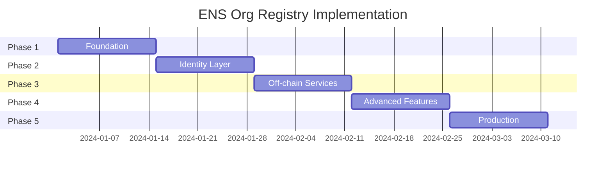

# Implementation Roadmap

A detailed 10-week roadmap for implementing the ENS Organizational Registry, from foundation to production deployment.

## Timeline Overview



---

## Phase 1: Foundation (Weeks 1-2)

### Goals

- Establish core ENS infrastructure
- Deploy basic registry and resolver contracts
- Set up development environment and testing framework

### Deliverables

#### Week 1: Smart Contract Foundation

- [ ] **ENSOrgRegistry Contract**
  - Core registration functionality
  - Basic access control with OpenZeppelin
  - Integration with existing ENS Registry
  - Event emissions for indexing

- [ ] **Basic OrgResolver Contract**
  - ENSIP-1 address resolution
  - ENSIP-5 text record support
  - Interface detection (EIP-165)
  - Governance-controlled updates

- [ ] **Development Environment**
  - Foundry project setup
  - Local testing with Anvil
  - CI/CD pipeline configuration
  - Code coverage and linting

#### Week 2: Testing & Deployment

- [ ] **Comprehensive Test Suite**
  - Unit tests for all contract functions
  - Integration tests with ENS Registry
  - Gas optimization analysis
  - Security vulnerability scanning

- [ ] **Testnet Deployment**
  - Deploy to Sepolia testnet
  - Domain acquisition for testing
  - Initial contract verification
  - Documentation of deployed addresses

### Technical Tasks

```solidity
// Core registry interface
interface IENSOrgRegistry {
    function registerOrganization(
        bytes32 node,
        OrgProfile calldata profile,
        GovernanceConfig calldata governance
    ) external;

    function setResolver(bytes32 node, address resolver) external;
    function getResolver(bytes32 node) external view returns (address);
}

// Basic resolver functionality
interface IOrgResolver {
    function addr(bytes32 node) external view returns (address);
    function text(bytes32 node, string calldata key) external view returns (string memory);
    function setText(bytes32 node, string calldata key, string calldata value) external;
}
```

### Success Criteria

- ✅ Contracts deployed and verified on testnet
- ✅ Basic registration flow working end-to-end
- ✅ 100% test coverage on core functions
- ✅ Gas costs optimized and documented

---

## Phase 2: Identity Layer (Weeks 3-4)

### Goals

- Implement rich metadata support
- Add multi-chain address resolution
- Create avatar and social link management
- Build web interface for organization setup

### Deliverables

#### Week 3: Enhanced Metadata

- [ ] **Extended Text Records**
  - ENSIP-5 compliance for social links
  - Custom organizational fields
  - Structured metadata validation
  - Bulk update operations

- [ ] **ENSIP-12 Avatar Support**
  - NFT avatar resolution
  - IPFS content handling
  - Image URL validation
  - Fallback mechanisms

- [ ] **Multi-chain Addresses (ENSIP-9/11)**
  - Ethereum mainnet (coin type 60)
  - Layer 2 networks (Polygon, Arbitrum, Optimism)
  - Address format validation
  - Batch address setting

#### Week 4: Web Interface

- [ ] **Registration Interface**
  - React-based form for organization setup
  - ENS domain validation
  - Profile picture upload to IPFS
  - Multi-chain address management

- [ ] **Management Dashboard**
  - View current organization profile
  - Update metadata through governance
  - Subdomain delegation interface
  - Activity history and logs

### Technical Implementation

```typescript
// Client-side registration
const client = new OrgRegistryClient({ provider, network: 'sepolia' });

await client.registerOrganization({
  name: 'testorg.eth',
  profile: {
    alias: 'Test Organization',
    description: 'A test DAO for development',
    avatar: 'ipfs://QmAvatarHash...',
    website: 'https://testorg.com',
    email: 'contact@testorg.com',
    socialLinks: {
      twitter: 'testorg',
      github: 'testorg',
      discord: 'https://discord.gg/testorg'
    }
  },
  addresses: {
    60: '0x1234...', // Ethereum
    137: '0x5678...', // Polygon
    42161: '0x9abc...' // Arbitrum
  },
  governance: {
    votingContract: '0xGovernanceContract...',
    proposalThreshold: '1000000000000000000', // 1 token
    votingDelay: 86400 // 1 day
  }
});
```

### Success Criteria

- ✅ All standard ENS text records supported
- ✅ Multi-chain addresses working across 3+ networks
- ✅ Web interface functional for basic operations
- ✅ IPFS integration working for avatars

---

## Phase 3: Off-chain Services (Weeks 5-6)

### Goals

- Deploy CCIP-Read gateway service
- Implement dynamic metadata fetching
- Add batch query optimization
- Set up caching and performance monitoring

### Deliverables

#### Week 5: CCIP-Read Gateway

- [ ] **Gateway Service (Node.js/Express)**
  - ENSIP-10 compliant endpoints
  - EIP-191 signature verification
  - Redis caching layer
  - Rate limiting and security

- [ ] **Dynamic Data Integration**
  - Real-time governance status
  - Member count and voting power
  - Proposal information
  - Treasury values

- [ ] **Resolver CCIP-Read Support**
  - OffchainLookup error handling
  - Signature validation on-chain
  - Fallback to on-chain data
  - TTL and cache management

#### Week 6: Performance & Batch Operations

- [ ] **ENSIP-21 Batch Gateway**
  - Multi-request processing
  - Parallel data fetching
  - Response aggregation
  - Performance optimization

- [ ] **Monitoring & Observability**
  - Prometheus metrics
  - Response time tracking
  - Error rate monitoring
  - Health check endpoints

### Technical Architecture

```typescript
// Gateway service structure
class CCIPGatewayService {
  async resolve(sender: string, data: string): Promise<{
    data: string;
    signature: string;
    expires: number;
  }> {
    // Decode call data
    const decodedCall = this.decodeCallData(data);

    // Fetch from cache or blockchain
    const result = await this.fetchData(decodedCall);

    // Sign response
    return this.createSignedResponse(sender, data, result);
  }

  async batchResolve(requests: ResolveRequest[]): Promise<ResolveResponse[]> {
    return Promise.all(requests.map(req => this.processRequest(req)));
  }
}
```

### Success Criteria

- ✅ CCIP-Read gateway deployed and functional
- ✅ Response times under 100ms for cached data
- ✅ Batch operations supporting 10+ simultaneous queries
- ✅ 99.9% uptime with monitoring alerts

---

## Phase 4: Advanced Features (Weeks 7-8)

### Goals

- Implement subdomain delegation system
- Add working group management
- Create governance integration workflows
- Build comprehensive management interface

### Deliverables

#### Week 7: Subdomain Management

- [ ] **Wildcard Resolution (ENSIP-10)**
  - Pattern matching for `*.org.eth`
  - Subdomain manager delegation
  - Hierarchical permission system
  - Team-specific metadata

- [ ] **Working Group Features**
  - Subdomain creation workflow
  - Role-based access control
  - Team member management
  - Budget and treasury allocation

- [ ] **DAOIP-6 Integration**
  - Signature-based subdomain creation
  - Member permission delegation
  - Gasless subdomain management
  - Governance approval workflows

#### Week 8: Complete Management Interface

- [ ] **Advanced Dashboard**
  - Organization overview with metrics
  - Subdomain management interface
  - Team member directory
  - Governance integration panel

- [ ] **Team Management**
  - Add/remove team members
  - Role assignment interface
  - Permission matrix visualization
  - Activity audit logs

### Implementation Details

```solidity
// Subdomain delegation
contract OrgResolver {
    mapping(bytes32 => mapping(bytes32 => address)) public subdomainManagers;

    function delegateSubdomain(
        bytes32 parent,
        string calldata label,
        address manager
    ) external onlyAuthorized(parent) {
        bytes32 labelHash = keccak256(bytes(label));
        subdomainManagers[parent][labelHash] = manager;
        emit SubdomainDelegated(parent, labelHash, manager);
    }

    function resolve(bytes memory name, bytes memory data)
        external view returns (bytes memory) {
        // Wildcard resolution logic
        (bytes32 parentNode, string memory label) = parseName(name);
        address manager = subdomainManagers[parentNode][keccak256(bytes(label))];

        if (manager != address(0)) {
            return ISubdomainManager(manager).resolve(name, data);
        }

        return _resolveStandard(parentNode, data);
    }
}
```

### Success Criteria

- ✅ Subdomain delegation working for 5+ use cases
- ✅ Working group management interface complete
- ✅ Governance workflows integrated and tested
- ✅ Advanced dashboard with real-time data

---

## Phase 5: Production (Weeks 9-10)

### Goals

- Security audit and vulnerability assessment
- Mainnet deployment and domain acquisition
- Community onboarding and documentation
- ENSIP proposal submission

### Deliverables

#### Week 9: Security & Deployment

- [ ] **Security Audit**
  - Professional smart contract audit
  - Penetration testing of gateway service
  - Vulnerability assessment and fixes
  - Final security review and sign-off

- [ ] **Mainnet Deployment**
  - Production contract deployment
  - Domain acquisition strategy
  - Multi-signature wallet setup
  - Emergency procedures documentation

- [ ] **Production Infrastructure**
  - Load-balanced gateway deployment
  - CDN configuration for global performance
  - Backup and disaster recovery
  - 24/7 monitoring and alerting

#### Week 10: Community & Documentation

- [ ] **Complete Documentation**
  - Developer integration guides
  - API reference documentation
  - Video tutorials and walkthroughs
  - Community onboarding materials

- [ ] **ENSIP Proposal**
  - Formal ENSIP draft submission
  - Community feedback incorporation
  - Rationale and specification
  - Reference implementation links

- [ ] **Migration Tools**
  - Existing DAO migration scripts
  - Bulk import utilities
  - Data validation tools
  - Support documentation

### Production Checklist

```bash
# Deployment verification
✅ Contracts deployed and verified on mainnet
✅ Domain ownership transferred to multisig
✅ Gateway service running on production infrastructure
✅ Monitoring and alerting configured
✅ Backup procedures tested
✅ Emergency response plan documented

# Community readiness
✅ Documentation complete and reviewed
✅ Integration examples working
✅ Developer SDK published to npm
✅ Community support channels established
✅ Initial DAOs migrated and using system
```

### Success Criteria

- ✅ Security audit passed with no critical issues
- ✅ Production system handling 1000+ organizations
- ✅ ENSIP proposal submitted and under review
- ✅ Community adoption with 10+ early adopters

---

## Resource Requirements

### Development Team

- **Smart Contract Engineer** (Full-time, 10 weeks)
- **Frontend Developer** (Full-time, 6 weeks)
- **Backend Developer** (Full-time, 6 weeks)
- **DevOps Engineer** (Part-time, 4 weeks)
- **Technical Writer** (Part-time, 4 weeks)

### Infrastructure

- **Development Environment**: Ethereum testnets, local nodes
- **Production Infrastructure**: AWS/GCP, CDN, monitoring
- **Third-party Services**: IPFS, blockchain APIs, audit firm
- **Domain Costs**: ENS domain acquisition and renewal

### Budget Estimate

- **Development**: $150k-200k (team salaries)
- **Infrastructure**: $5k-10k (first year)
- **Audit**: $30k-50k (professional security review)
- **Domains**: $5k-20k (depending on domain choice)
- **Total**: $190k-280k

---

## Risk Mitigation

### Technical Risks

- **Smart Contract Bugs**: Comprehensive testing, formal verification
- **Scalability Issues**: Load testing, performance optimization
- **Integration Failures**: Extensive integration testing

### Business Risks

- **Low Adoption**: Community engagement, migration incentives
- **Governance Disputes**: Clear governance documentation
- **Regulatory Issues**: Legal review, jurisdiction considerations

### Operational Risks

- **Service Downtime**: Redundancy, disaster recovery
- **Security Breaches**: Regular audits, monitoring
- **Team Availability**: Documentation, knowledge sharing
